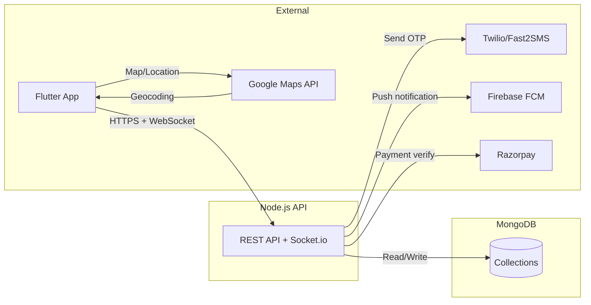
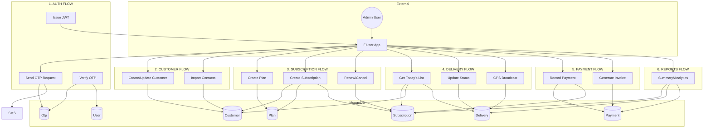
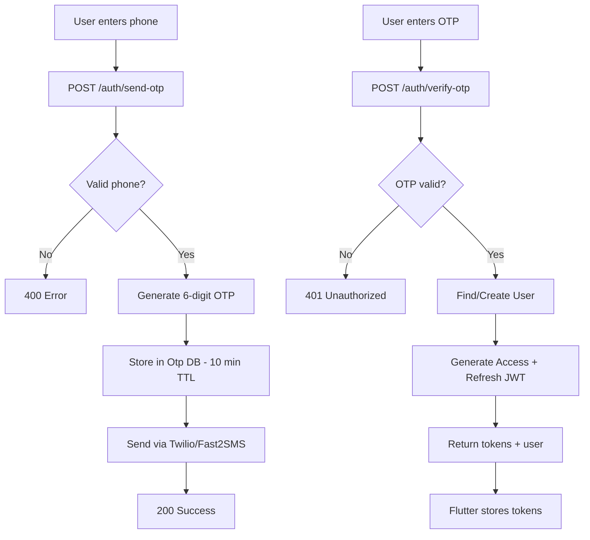
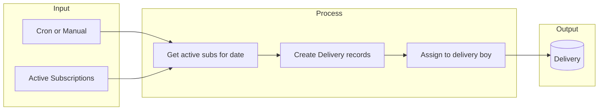
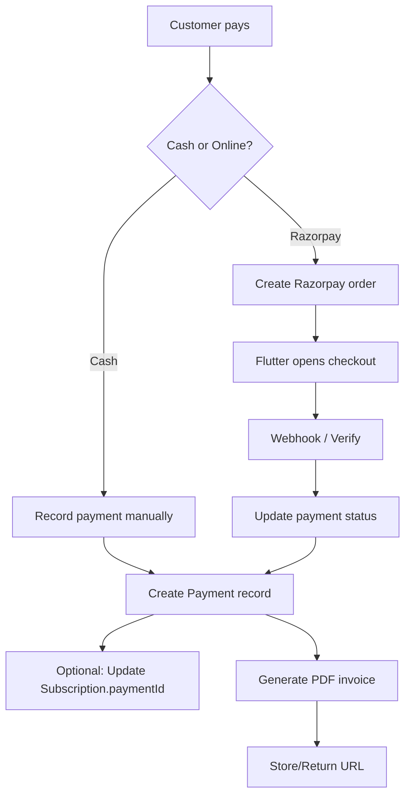
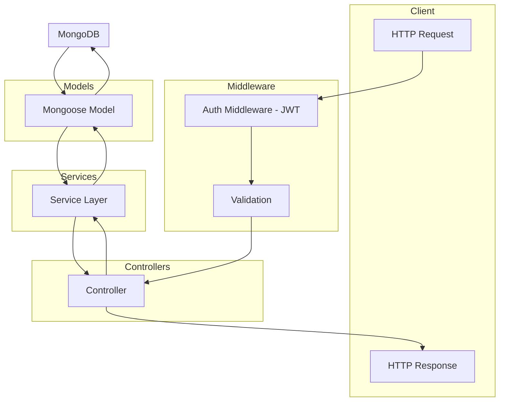

# TiffinCRM — Data Flow Diagram

View in VS Code (Mermaid extension), GitHub, or [mermaid.live](https://mermaid.live).

---

## Level 0 — High-level system flow

---

## Level 1 — Core data flows by feature

---

## Level 2 — Detailed process flows

### Auth flow

### Subscription → Delivery flow

### Payment flow

---

## Level 3 — Request/response flow (API → DB)

---

## Summary

| Flow           | Trigger        | Data in           | Process                     | Data out                |
|----------------|----------------|-------------------|-----------------------------|--------------------------|
| Auth (OTP)     | Flutter        | phone             | Send OTP, store in Otp      | SMS sent                 |
| Auth (Verify)  | Flutter        | phone, otp        | Verify, find/create User    | JWT, user                |
| Customer       | Flutter        | name, phone, addr | CRUD on Customer            | Customer doc             |
| Plan           | Flutter        | name, type, price | CRUD on Plan                | Plan doc                 |
| Subscription   | Flutter        | customerId, planId, dates | Create Subscription    | Subscription doc        |
| Delivery       | Cron / Flutter  | date, subscriptions | Create/update Delivery   | Delivery list            |
| Payment        | Flutter + Webhook | amount, method | Create Payment, update Sub  | Payment, invoice URL     |
| Reports        | Flutter        | period, filters   | Aggregate from collections  | Summary JSON             |
