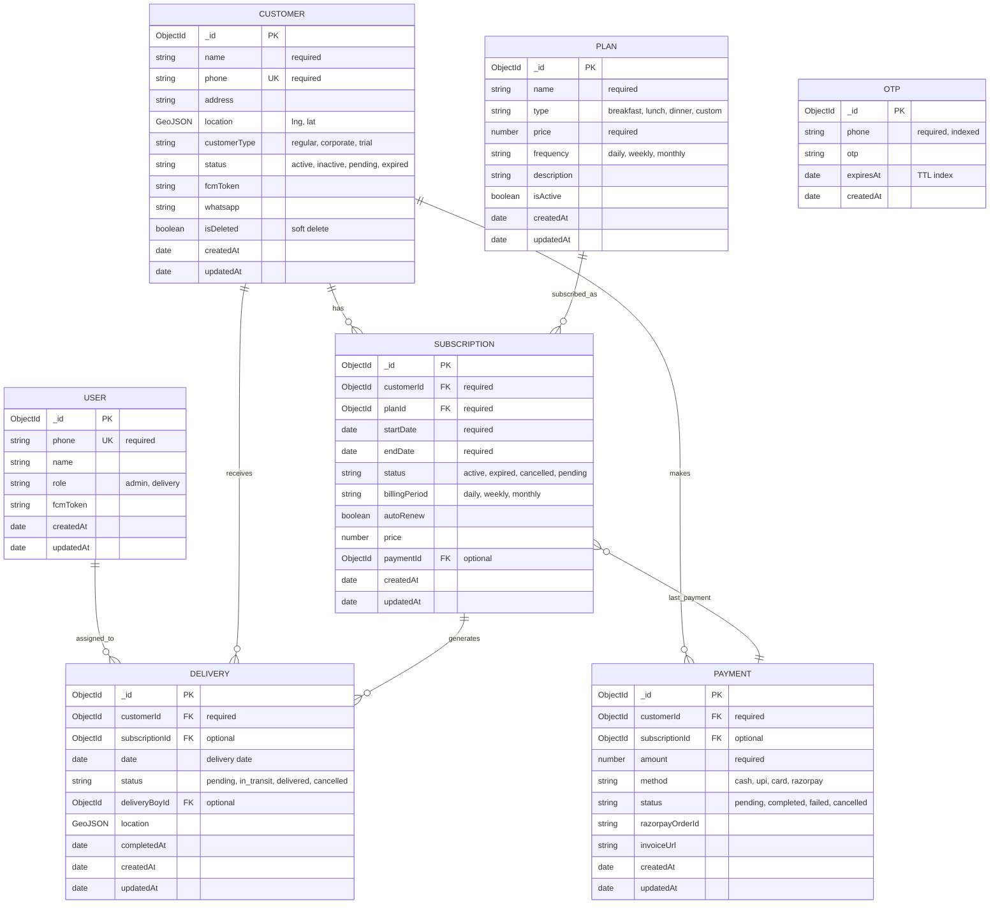

# TiffinCRM — Entity Relationship Diagram

## Mermaid ER Diagram

View this file in VS Code (with Mermaid extension), GitHub, or [mermaid.live](https://mermaid.live).

---

## Relationship summary

| From        | To            | Cardinality | Description                    |
|------------|---------------|-------------|--------------------------------|
| User       | Delivery      | 1 : 0..n    | User (delivery boy) does many deliveries |
| Customer   | Subscription  | 1 : 0..n    | Customer has many subscriptions |
| Customer   | Delivery      | 1 : 0..n    | Customer receives many deliveries |
| Customer   | Payment       | 1 : 0..n    | Customer makes many payments |
| Plan       | Subscription  | 1 : 0..n    | Plan has many subscriptions |
| Subscription | Delivery    | 1 : 0..n    | Subscription generates many deliveries |
| Subscription | Payment     | 0..1 : 1    | Subscription has optional “last payment” reference |
| Otp        | —             | —           | Standalone; no FK to other entities |

---

## Legend

- **PK** = Primary Key (`_id`)
- **FK** = Foreign Key (reference to another collection)
- **UK** = Unique
- **GeoJSON** = `{ type: "Point", coordinates: [longitude, latitude] }`
